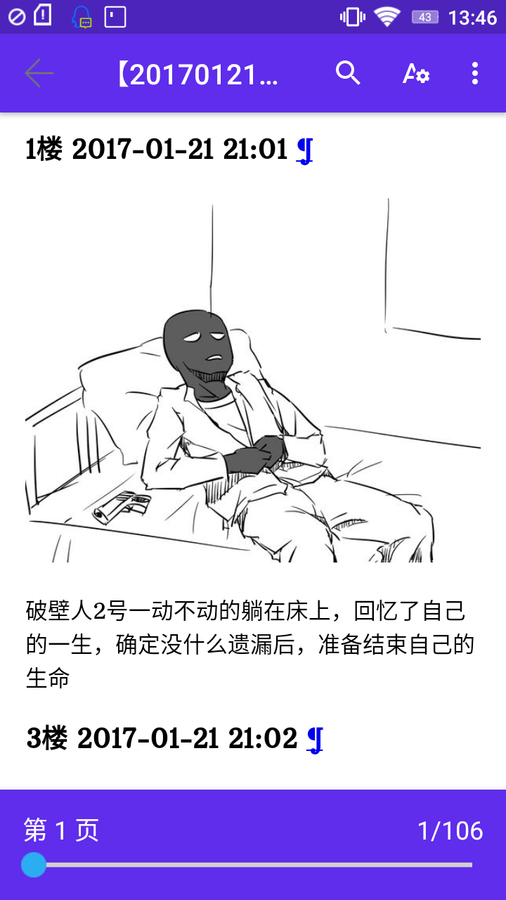

# Canoe

个人级星舰。收集三体吧文档。

效果：



利用tieba-to-epub项目，将贴子转换为epub电子书。

项目地址:https://github.com/lexdene/tieba-post-to-epub

epub电子书放在ebook目录。

# 作者及书籍信息

可以在[Author](Author.md)看到。


### Android端参与工作

在Android上利用Termux可以完成此工作。


Termux是一个Android终端，以下内容为shell命令。


**step1**

```shell
termux-setup-storage
```

**step2**

```shell
apt update && \
apt install libxml2 libxml2-dev libxslt libxslt-dev openssl libffi libffi-dev openssl-tool openssl-dev fftw fftw-dev libzmq libzmq-dev freetype freetype-dev pkg-config scrypt -y && \
pkg install libcrypt libcrypt-dev ccrypt libgcrypt libgcrypt-dev libpng libpng-dev -y
pkg install clang python-dev python -y
pip install lxml
```

**step3**

```shell
pip install -U tieba-to-epub
```	

**step4**

获取一个帖子的id

例子：

https://tieba.baidu.com/p/4949361390?lp=5027&mo_device=1&is_jingpost=1&pn=0&

id:4949361390

**step5**

```shell
tieba-to-epub 4949361390 dark.epub
cp dark.epub /sdcard/dark.epub
```

然后就可以本地阅读了。


